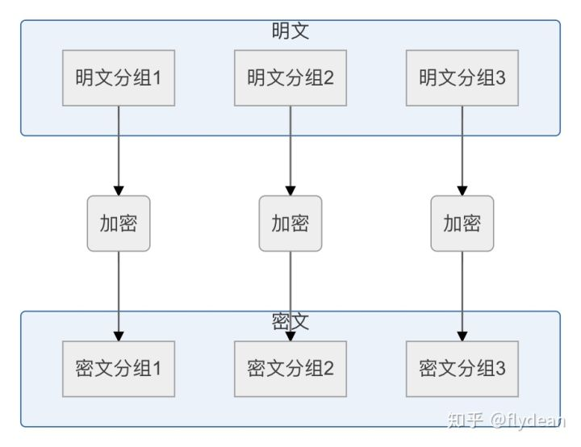
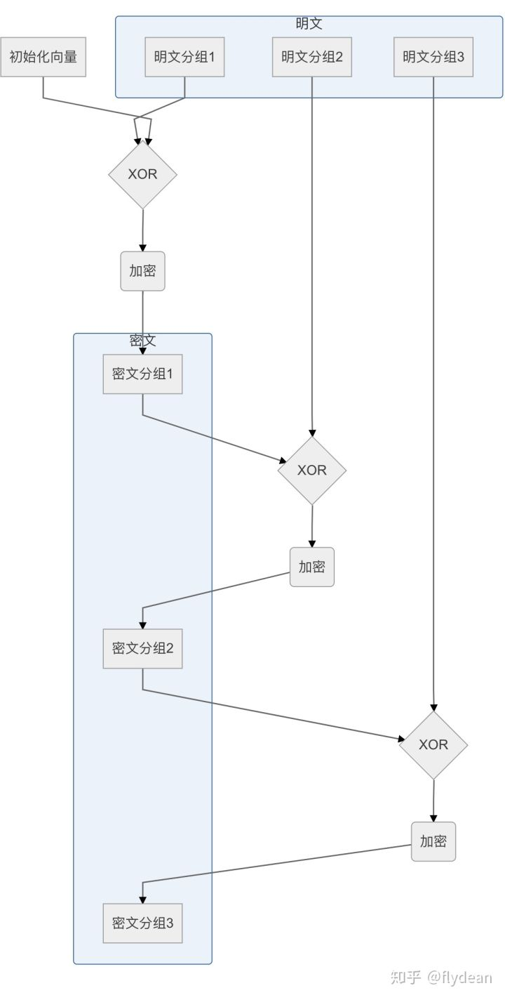
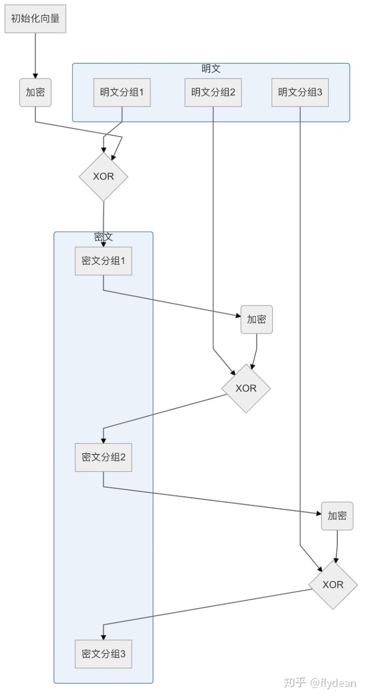

# AES加密
AES(Advanced Encryption Standard)属于块加密(分组加密)。       
不难理解，对越长的字符串进行加密，代价越大，所以通常对明文进行分段，然后对每段明文进行加密，最后再拼成一个字符串。  

## 加密模式(常用三种)  
* 电码本模式(Electronic CodeBook Book(ECB))

        这种模式是将整个明文分成若干段相同的小段，然后对每一小段进行加密。
        由于每块数据的加密是独立的因此加密和解密都可以并行计算。
        最大的缺点是相同的明文块会被加密成相同的密文块，这些方法在某些环境下不能提供严格的数据保密性。      

* 密码分组链接模式(Cipher Block Chaining(CBC))  

        这种模式是对于每个待加密的密码块在加密前会与前一个密码块的密文异或然后再用密码器加密。第一个明文块与一个叫初始化向量的数据块异或。
        CBC模式相比ECB有更高的保密性，但由于对每个数据块的加密依赖与前一个数据块的加密所以无法并行。与ECB一样在加密前需要对数据进行填充，不是很适合对流数据进行加密。

  

* 密文反馈模式(Cipher Feedback(CFB))

        在CFB模式中，前一个密文分组会首先进行加密，然后再与明文分组进行异或运算，最后得到密文分组。

## AES128，AES256的区别  
表示期待秘钥的长度，比如AES256秘钥的长度应该是256/8的32字节，一些语言的库会自动截取，让人以为任何长度的秘钥都可以，但是这其实是有区别的。       

## IV
IV称为初始向量，不同的IV加密后的字符串是不同的，加密和解密需要相同的IV,既然IV看起来和key一样，却还要多一个IV的目的，对于每个块来说，key是不变的，但是只有第一个块的IV是用户提供的，其他块IV都是自动生成。       
IV的长度为16字节。超过或者不足，可能实现的库都会进行补齐或截断。但是由于块的长度是16字节，所以一般可以认为需要的IV是16字节。  

## PADDING
块加密的一个要面临的问题就是如何填满最后一块？所以这就是PADDING的作用，使用各种方式填满最后一块字符串，所以对于解密端，也需要用同样的PADDING来找到最后一块中的真实数据的长度。大部分PADDING模式为PKCS5, PKCS7, NOPADDING。 

## 加密解密端  
* 加密端: 应该包括：加密秘钥长度，秘钥，IV值，加密模式，PADDING方式。       
* 解密端: 应该包括：解密秘钥长度，秘钥，IV值，解密模式，PADDING方式。

## 代码实现  
* [Node实现](encrypt/node-aes.js)
* [crypto-js实现](encrypt/aes.js)       

Node端的实现不能自己配置padding模式。